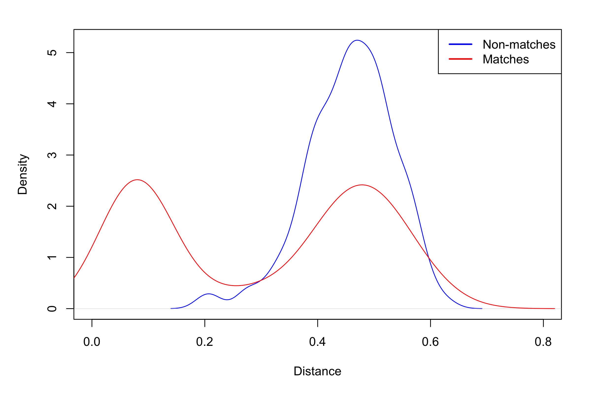

```{r setup, include=FALSE}
knitr::opts_chunk$set(echo = FALSE, warning = FALSE, message = FALSE)
library("kableExtra")
```

# Introduction

## Blocking for record linkage

Entity resolution (probabilistic record linkage, deduplication) is
essential for estimation based on multiple sources
(cf. @fellegi1969theory, @Binette2022). The goal is to link records
without common identifiers that refer to the same entity (e.g., person,
company, job position). This situation is frequently observed in
administrative records, particularly for foreign-born populations. For
instance, the Social Insurance Institution register in Poland at the end
of 2023 included 1.206 million records referring to approximately 1.105
million individuals, of which about 10% had missing information in the
personal identifier (PESEL) and about 50% had missing address details.
Note that the exact number of individuals is certainly lower than 1.105
million, as the 10% with missing identifiers may include duplicates
(cf. @beresewicz2025estimation).

This drives the need to link records without identifiers, which often
requires certain assumptions about how to reduce the large number of
possible comparisons, as it is not feasible to compare all pairs of
records in large datasets (e.g., the aforementioned example would
require over 6 billion comparisons). Consequently, researchers aim to
reduce the number of comparisons in various ways prior to the record
linkage/deduplication stage. The rationale is twofold: computational
resource constraints and clerical review workload.

Reducing the number of comparisons is accomplished through blocking, a
method that limits possible comparisons by assuming that certain
variables must match exactly or that combinations of variables should
match above a specified threshold. For instance, a standard approach
assumes that sex or birth year must match exactly, whilst other record
characteristics may vary. Another method employs phonetic algorithms
such as Soundex (cf. @Wright1960) or its adaptations for non-English
languages (cf. @Howard2020) to block records that sound similar but
are spelt differently (e.g., Smith and Smyth, or Anna and Ania).
Furthermore, with the growing popularity of large language models (both
closed and open-source), one may consider using embeddings
[@mikolov2013efficient] to identify nearest neighbours and treat these
as potential comparison pairs. For a comprehensive review of blocking
methods, see @Steorts2014 or @Papadakis2020. Section 1.2 discusses
existing R packages that implement blocking methods.

Reducing the number of pairs has inherent costs: missed comparisons lead
to increased false positive rates (FPR) and false negative rates (FNR)
in linkage studies. To assess these errors, a subset of true pairs
should be provided, or simulation studies of proposed methods should be
conducted. Alternatively, one may consider approaches proposed by
@dasylva2021estimating and @dasylva2022consistent, who demonstrated how
to estimate FPR and FNR without access to an audit sample.

## Existing software and our contribution {#sec-software}

The R ecosystem offers several packages that implement various blocking
techniques, which we have grouped according to the following
classification:

-   **Deterministic blocking**:
    -   \CRANpkg{reclin2} (@reclin2, @reclin2-rjournal) allows pairing
        records using `pair_blocking()` with a prespecified list of
        columns in a `data.frame`, and the `pair_minsim()` function,
        which allows specifying the minimal similarity score (e.g., 1
        out of 3 variable values must match exactly).
    -   \CRANpkg{RecordLinkage} (@RecordLinkage, @RecordLinkage-rjournal)
        allows specifying blocking variables in the `blockfld` parameter
        of either `compare.dedup()` or `compare.linkage()` functions as
        a vector (either character or numeric).
    -   \CRANpkg{fastLink} (@fastLink, @enamorado2019using) implements
        various blocking methods via the `blockData()` function,
        including exact matching, window matching (e.g., no more than
        2-year difference between birth years), and $k$-means clustering.
        Notably, `fastLink` returns datasets split into separate lists,
        whilst `reclin2` and `RecordLinkage` packages create a single
        dataset.
-   **Phonetic blocking**:
    -   \CRANpkg{RecordLinkage} allows direct specification of phonetic
        comparison via the `phonetic` argument in `compare.dedup()` or
        `compare.linkage()` functions using the `soundex()` function.
        However, this is used for string comparison rather than
        blocking.
    -   Additionally, \CRANpkg{stringdist} [@stringdist] implements the
        Soundex algorithm, whilst \CRANpkg{phonics} [@phonics] implements various phonetic algorithms that can be applied prior to the blocking procedure (e.g., to create a
        new column).
-   **Probabilistic blocking**:
    -   \CRANpkg{klsh} [@klsh] is the only R package that implements
        probabilistic blocking using the $k$-means variant of locality
        sensitive hashing. The main `klsh()` function implements this
        approach, and the resulting object is a list containing row
        identifiers for the prespecified number of blocks (via the
        `num.blocks` argument).

In practice, the situation is more complicated, as missing data may be
present in blocking/matching variables (such as birth dates) or typos
may occur in names and surnames. Therefore, we developed
\CRANpkg{blocking}, which leverages approximate nearest neighbour (ANN)
algorithms and graphs to create numerous small blocks that can be used
in subsequent analysis. This approach is similar to micro-clustering
(cf. @johndrow2018theoretical), but we do not aim at providing the final 
linkage of units between or within sources. The basic workflow of the
\CRANpkg{blocking} package consists of the following steps:

1.  Create shingles of the input character vectors using
    \CRANpkg{tokenizers} [@tokenizers] and \CRANpkg{text2vec}
    [@text2vec] packages, or provide a matrix of vectors (e.g.,
    embeddings via \CRANpkg{ragnar}, @ragnar) representing the input
    character vectors.
2.  Search for nearest neighbours using ANN algorithms implemented in
    \CRANpkg{rnndescent} [@rnndescent], \CRANpkg{RcppHNSW} [@RcppHNSW],
    \CRANpkg{mlpack} (@mlpack2023, @mlpack2025), and \CRANpkg{RcppAnnoy}
    [@RcppAnnoy].
3.  Create final blocks using \CRANpkg{igraph} (@igraph2025,@igraph2006).

This is the only package in the R ecosystem that readily applies modern
ANN algorithms to reduce the number of comparisons and significantly
accelerate record linkage and deduplication tasks. Additionally, we have
developed the `pair_ann()` function for seamless integration with the
\CRANpkg{reclin2} package, as described in one of the package vignettes.

## Outline of article

This paper is structured as follows. Section 2 provides a description of
the main functionalities of the \CRANpkg{blocking} package and how
results can be assessed. Section 3 presents two case studies:
probabilistic record linkage and deduplication. These examples
demonstrate how our package can improve the entity resolution pipeline
and integrate with existing R packages.

# Blocking of records using `blocking()` function {#sec-blocks}

## The main function

The main functionality is available via the `blocking()` function, which
contains the following key arguments:

-   `x, y` -- reference vectors, where `y = NULL` indicates that
    deduplication is applied;
-   `representation` -- whether `x` and `y` should be represented as
    shingles or vectors (e.g., provided by the user via the `model`
    argument);
-   `ann` -- which ANN algorithm should be applied (by default, we use
    the \CRANpkg{rnndescent} package as it supports sparse matrices);
-   `distance` -- which distance metric should be applied (default is
    `cosine` distance);
-   `graph` -- whether a plot of the graph showing connected records
    should be returned (default `FALSE`);
-   `true_blocks` -- if a subset of true blocks is available, it can be
    provided here so that quality measures, presented in the next
    section, are returned;
-   `n_threads` -- number of threads used for computation;
-   `control_txt` -- controls provided via `controls_txt()` specifying
    how `x, y` are processed;
-   `control_ann` -- controls provided via `controls_ann()` allowing
    users to fine-tune the ANN algorithm (see documentation for the
    `controls_ann()` function and `control_*` functions with names
    referring to specific algorithms, e.g., `control_nnd()` for the NND
    algorithm).

This function returns an object of class `blocking` containing the
following elements:

-   `result` -- a `data.table` with indices (rows) of x, y, block, and
    distance between points;
-   `method` -- name of the ANN algorithm used;
-   `deduplication` -- information about whether deduplication was
    applied;
-   `representation` -- information about whether shingles or vectors
    were used;
-   `metrics` -- quality assessment metrics, if `true_blocks` is
    provided;
-   `confusion` -- confusion matrix, if `true_blocks` is provided;
-   `colnames` -- variable names (`colnames`) used for search;
-   `graph` -- an `igraph` class object.

## Assessment of results {#sec-assess}

The package implements several measures that can be used to assess
results. The first is the *reduction ratio* (RR), which indicates the
reduction in comparison pairs within the given blocks. It has a value
between $[0,1]$, where 1 indicates perfect reduction whilst values close
to 0 indicate poor reduction. The RR indicator for deduplication has the
following form:

$$
\text{RR}_{\text{dedup}} = 1 - \frac{\sum\limits_{i=1}^{k} \binom{|B_i|}{2}}{\binom{n}{2}},
$$

\noindent where $k$ is the total number of blocks, $n$ is the total
number of records in the dataset, and $|B_i|$ is the number of records
in the $i$-th block. $\sum\limits_{i=1}^{k} \binom{|B_i|}{2}$ is the
number of comparisons after blocking, whilst $\binom{n}{2}$ is the total
number of possible comparisons without blocking. For record linkage, the
reduction ratio is defined as follows:

$$
\text{RR}_{\text{reclin}} = 1 - \frac{\sum\limits_{i=1}^{k} |B_{i,x}| \cdot |B_{i,y}|} {m \cdot n},
$$

\noindent where $m$ and $n$ are the sizes of datasets $X$ and $Y$, and
$k$ is the total number of blocks. The term $|B_{i,x}|$ is the number of
unique records from dataset $X$ in the $i$-th block, whilst $|B_{i,y}|$
is the number of unique records from dataset $Y$ in the $i$-th block.
The expression $\sum\limits_{i=1}^{k} |B_{i,x}| \cdot |B_{i,y}|$
represents the number of comparisons after blocking.

Another way to assess blocking is to examine the confusion matrix at the
*block* level, i.e., blocking results are compared with ground-truth
*blocks* in a pairwise manner (e.g., one true positive pair occurs when
both records from the comparison pair belong to the same predicted
*block* and to the same ground-truth *block* in the evaluation
`data.frame`). The values in this table are defined as follows:

-   True positive (TP): record pairs correctly matched in the same
    block.
-   False positive (FP): record pairs identified as matches that are not
    true matches in the same block.
-   True negative (TN): record pairs correctly identified as non-matches
    (different blocks).
-   False negative (FN): record pairs identified as non-matches that are
    true matches in the same block.

Metrics calculated based on this confusion matrix are presented in
Table 1.

| **Metric** | **Formula** | **Metric** | **Formula** |
|------------------|------------------|------------------|------------------|
| Recall | $\frac{TP}{TP + FN}$ | Accuracy | $\frac{TP + TN}{TP + TN + FP + FN}$ |
| Precision | $\frac{TP}{TP + FP}$ | Specificity | $\frac{TN}{TN + FP}$ |
| F1 Score | $2 \cdot \frac{\text{Precision} \times \text{Recall}}{\text{Precision} + \text{Recall}}$ | False Positive Rate | $\frac{FP}{FP + TN}$ |
| False Negative Rate | $\frac{FN}{FN + TP}$ |  |  |

: Evaluation Metrics


# Case studies {#sec-case}

## An example of blocking for record linkage

Let us first load the required packages.

```{r packages, echo=TRUE, message=FALSE, warning=FALSE}
library("blocking")
library("data.table")
library("reclin2")
```

We demonstrate the use of the `blocking()` function for record linkage
on the `foreigners` dataset included in the package. This fictional
representation of the foreign population in Poland was generated based
on publicly available information, preserving the distributions from
administrative registers. It contains 110,000 rows with 100,000 entities
(thus containing 10,000 duplicates). Each row represents one record,
with the following columns: `fname` -- first name, `sname` -- second
name, `surname` -- surname, `date` -- date of birth, `region` -- region
(county), `country` -- country, and `true_id` -- a person identifier.

Next, we load the data and examine the first six records.

```{r foreigners, echo = TRUE}
data("foreigners")
head(foreigners)
```

In the next step, we split the dataset into two separate `data.frame`s:
one containing the first appearance of each entity in the `foreigners`
dataset, and the other containing subsequent appearances. We then add
row identifiers (`x` and `y`).

```{r split, echo = TRUE}
foreigners_1 <- foreigners[!duplicated(foreigners$true_id), ]
foreigners_1[, x := 1:.N]
foreigners_2 <- foreigners[duplicated(foreigners$true_id), ]
foreigners_2[, y := 1:.N]
```

Now, in both datasets we remove separators from the date column and
create a new character column that concatenates information from all
columns (excluding `true_id`) in each row. Information stored in the
`txt` column will be used for blocking records in the `blocking()`
function.

```{r concat, echo = TRUE}
foreigners_1[, txt := paste0(fname, sname, surname, gsub("/", "", date), 
                             region, country)]
foreigners_2[, txt := paste0(fname, sname, surname, gsub("/", "", date), 
                             region, country)]
head(foreigners_1[, .(true_id, txt)])
```

The default algorithm is the Nearest Neighbour Descent Method
[@Dong2011] implemented in the \CRANpkg{rnndescent} package. Note that a
default parameter of the `blocking()` function is `seed = 2023`, which sets
the random seed.


```{r reclin_nnd, echo = TRUE, eval = FALSE}
result_reclin <- blocking(x = foreigners_1$txt,
                          y = foreigners_2$txt)
```

```{r reclin_nnd_load, echo = FALSE}
result_reclin <- readRDS("data/result_reclin.rds")
```

```{r reclin_nnd_calcs}
blocks_tab <- table(result_reclin$result$block)
block_ids <- rep(as.numeric(names(blocks_tab)), blocks_tab+1)
block_size <- as.numeric(names(table(table(block_ids))))
block_count <- as.vector(table(table(block_ids)))
```

Now, we can examine the results by printing the `result_reclin` object.
In this example, we have created
`r format(NROW(unique(result_reclin$result$block)), big.mark = ",")`
blocks based on `r format(NROW(result_reclin$colnames), big.mark = ",")`
columns (2-character shingles). Blocks are small, as we have
`r format(block_count[1], big.mark = ",")` blocks of `r block_size[1]`
elements, `r format(block_count[2], big.mark = ",")` blocks of
`r block_size[2]` elements, ...,
`r format(block_count[NROW(block_count)], big.mark = ",")` blocks of
`r block_size[NROW(block_size)]` elements.

```{r reclin_nnd_summary, echo = TRUE}
result_reclin
```

To access the result, one should use `result_reclin$result`. The
resulting data.table has four columns (as presented below):

-   `x` -- reference dataset (i.e., `foreigners_1`) -- this may not
    contain all units of `foreigners_1`;
-   `y` -- query (each row of `foreigners_2`) -- this will contain all
    units of `foreigners_2`;
-   `block` -- the block identifier;
-   `dist` -- distance between pairs.

```{r reclin_nnd_result, echo = TRUE}
head(result_reclin$result)
```

Let's examine the first block. Clearly, there are typos in the `fname`
and `surname`. Nevertheless, all records refer to the same entity (as
denoted by `true_id`).

```{r reclin_nnd_example, echo = TRUE}
rbind(foreigners_1[3, 1:7], foreigners_2[1:2, 1:7])
```

Now we use the `true_id` column to evaluate our approach.

```{r reclin_nnd_matches, echo = TRUE}
matches <- merge(x = foreigners_1[, .(x, true_id)],
                 y = foreigners_2[, .(y, true_id)],
                 by = "true_id")
matches[, block := rleid(x)]
head(matches)
```

We have 10,000 matched pairs, which can be used in the true_blocks
argument of the `blocking()` function to specify the true block
assignments. We obtain quality metrics for the assessment of record
linkage.

```{r reclin_nnd_true_blocks, echo = TRUE, eval = FALSE}
res_reclin <- blocking(x = foreigners_1$txt,
                       y = foreigners_2$txt,
                       true_blocks = matches[, .(x, y, block)])
```

```{r reclin_nnd_true_blocks_load, echo = FALSE}
res_reclin <- readRDS("data/result_reclin_matches.rds")
```

```{r reclin_nnd_true_blocks_print, echo = TRUE}
res_reclin
```

For example, our approach results in a\ `r sprintf("%.2f", (res_reclin$metrics)[4]*100)`% FNR. To improve this,
we can increase the epsilon parameter of the NND method from 0.1 to 0.5.
To do so, we configure the `control_ann` parameter in the `blocking()`
function using the `controls_ann()` and `control_nnd()` functions.

```{r reclin_nnd_improved, echo = TRUE, eval = FALSE}
res_reclin2 <- blocking(x = foreigners_1$txt,
                        y = foreigners_2$txt,
                        true_blocks = matches[, .(x, y, block)],
                        control_ann = controls_ann(nnd = control_nnd(epsilon = 0.5)))
```

```{r reclin_nnd_improved_load, echo = FALSE}
res_reclin2 <- readRDS("data/result_reclin_matches.rds")
```

```{r reclin_nnd_improved_print, echo = TRUE}
res_reclin2
```

That decreases the FNR to
`r sprintf("%.2f", (res_reclin2$metrics)[4]*100)`%.

Now, to use the result in the record linkage process, we add this
information to both datasets and specify it in the appropriate argument
of a given function. Below, we present an example using the `reclin2`
package with a simple score.

```{r reclin2-example, echo = TRUE}
foreigners_1[res_reclin2$result, on = "x", block:= i.block]
foreigners_2[res_reclin2$result, on = "y", block:= i.block]

pair_blocking(x = foreigners_1, 
              y = foreigners_2, on = "block") |>
  compare_pairs(on = c("fname", "surname", "date"),
                default_comparator = cmp_jarowinkler()) |>
  score_simple("score", on = c("fname", "surname", "date")) |>
  head(n= 4)
```

## An example of blocking for deduplication

In this section, we demonstrate a\ deduplication application using the
`blocking()` function on the `RLdata500` dataset from the
\CRANpkg{RecordLinkage} package. Note that the dataset is included in
the `blocking` package. It contains artificial personal data, and fifty
records have been duplicated with randomly generated errors. Each row
represents one record, with the following columns: `fname_c1` -- first
name, `fname_c2` -- second name, `lname_c1` -- last name, `lname_c2` --
last name (second component), `by`, `bm`, `bd` -- year, month, and day
of birth, `rec_id` -- record ID, and `ent_id` -- entity ID.

```{r RLdata500, echo = TRUE}
data("RLdata500")
head(RLdata500)
```

For the purpose of this example, we create a new column (`id_count`)
that indicates how many times a given unit occurs, and then add leading
zeros to the `bm` and `bd` columns. Finally, we create a new string
column that concatenates information from all columns (excluding
`rec_id`, `ent_id`, and `id_count`), as presented below.

```{r RLdata500_concat, echo = TRUE}
RLdata500[, id_count :=.N, ent_id]
RLdata500[, txt:=tolower(paste0(fname_c1,fname_c2,lname_c1,lname_c2,by,
                                sprintf("%02d", bm),sprintf("%02d", bd)))]
head(RLdata500[, .(rec_id, id_count, txt)])
```

As in the previous example, we use the `txt` column in the `blocking()`
function. This time, we set `ann = "hnsw"` to use the Hierarchical
Navigable Small World (HNSW; @malkov2018efficient) algorithm from the
\CRANpkg{RcppHNSW} package.

```{r dedup_hnsw, echo = TRUE}
res_dedup <- blocking(x = RLdata500$txt,
                      ann = "hnsw",
                      verbose = 1)
```

The results are as follows. This time, the HNSW algorithm provided
blocks varying from 2 to 17 units.

```{r dedup_hnsw_result, echo = TRUE}
res_dedup
```

Next, we create a long `data.table` with information on blocks and units
from the original dataset. We add the block information to the final
dataset. We can check in how many blocks the same entities (`ent_id`)
are observed. In our example, all identical entities are in the same
blocks.

```{r dedup_melted, echo = TRUE}
df_block_melted <- melt(res_dedup$result, id.vars = c("block", "dist"))
df_block_melted_rec_block <- unique(df_block_melted[, .(rec_id=value, block)])
RLdata500[df_block_melted_rec_block, on = "rec_id", block_id := i.block]
RLdata500[, .(uniq_blocks = uniqueN(block_id)), .(ent_id)][, .N, uniq_blocks]
```

Additionally, we visualise the result based on whether a block contains
matches or not.

```{r fig-save, results = 'hide'}
png(file = "./figures/fig-1-density.png", 
    width = 2400,
    height = 1600,
    res = 300,  
    pointsize = 12)

par(mar = c(5, 5, 2, 2))  # Adjust margins


df_for_density <- copy(df_block_melted[block %in% RLdata500$block_id])
df_for_density[, match:= block %in% RLdata500[id_count == 2]$block_id]

plot(density(df_for_density[match==FALSE]$dist),
     col = "blue", xlim = c(0, 0.8), main = "", xlab = "Distance")
lines(density(df_for_density[match==TRUE]$dist),
      col = "red", xlim = c(0, 0.8))
legend("topright",  legend = c("Non-matches", "Matches"), 
       col = c("blue", "red"),  lty = 1, lwd = 2)
dev.off()
```

```{r penguins-alison, out.width = "80%", fig.cap = "Distribution of distances between true matches and non-matches within blocks", fig.alt="A density plot of distances between units that are true matches (red) and non-matches (blue) within blocks created by the \\CRANpkg{blocking}. The distribution of distance for matches is bimodal. There is a group of units that are true matches where the distance between them is small (less than 0.2), whilst for the second group, the distance is similar to true non-matches (between 0.4 and 0.6). This distance may be used as additional information for deduplication (and record linkage) studies."}

```

Finally, we compare the evaluation metrics across all ANN algorithms
supported by the `blocking()` function, i.e., NND, HNSW, Annoy (from the
\CRANpkg{RcppAnnoy} package), Locality-Sensitive Hashing (LSH, from the
\CRANpkg{mlpack} package), and $k$-Nearest Neighbours (kNN -- denoted as
`"kd"`, from the \CRANpkg{mlpack} package). We use the `rec_id` and
`ent_id` columns from the `RLdata500` dataset to specify the true blocks
and then calculate evaluation metrics for all algorithms.

We compare our package with the `klsh()` function from the
\CRANpkg{klsh} package, configured to create 10 blocks (denoted as
`klsh_10`) and 100 blocks (denoted as `klsh_100`), respectively. In both
settings, we use 20 random projections and 2-character shingles. The
results are presented in Table 2.

```{r echo = TRUE, results='asis'}
#| label: comparision
#| tab.cap: "Comparison of various approximate nearest neighbour algorithms implemented in the \\CRANpkg{blocking} and the \\CRANpkg{klsh} package for creation of blocks for deduplication"
set.seed(2025)
true_blocks <- RLdata500[, c("rec_id", "ent_id"), with = FALSE]
setnames(true_blocks, old = c("rec_id", "ent_id"), c("x", "block"))
eval_metrics <- list()
ann <- c("nnd", "hnsw", "annoy", "lsh", "kd")
for (algorithm in ann) {
  eval_metrics[[algorithm]] <- blocking(
    x = RLdata500$txt,
    ann = algorithm,
    true_blocks = true_blocks)$metrics
}

blocks_klsh_10 <- klsh::klsh(
  r.set = RLdata500[, c("fname_c1", "fname_c2", "lname_c1",
                        "lname_c2", "by", "bm", "bd")],
  p = 20, num.blocks = 10, k = 2)

klsh_10_metrics <- klsh::confusion.from.blocking(
  blocking = blocks_klsh_10, 
  true_ids = RLdata500$ent_id)[-1]

klsh_10_metrics$f1_score <- with(klsh_10_metrics, 
                                 2*precision*recall/(precision + recall))

eval_metrics$klsh_10 <- unlist(klsh_10_metrics)

blocks_klsh_100 <- klsh::klsh(
  r.set = RLdata500[, c("fname_c1", "fname_c2", "lname_c1",
                        "lname_c2", "by", "bm", "bd")],
  p = 20, num.blocks = 100, k = 2)

klsh_100_metrics <- klsh::confusion.from.blocking(
  blocking = blocks_klsh_100, 
  true_ids = RLdata500$ent_id)[-1]

klsh_100_metrics$f1_score <- with(klsh_100_metrics, 
                                 2*precision*recall/(precision + recall))

eval_metrics$klsh_100 <- unlist(klsh_100_metrics)

round(do.call(rbind, eval_metrics) * 100, 2) |> kable(digits=2) 
```

The results demonstrate a clear performance hierarchy among the ANN
algorithms implemented in the `blocking` package, with traditional
tree-based methods (NND, HNSW, Annoy, and kNN) achieving perfect recall
(100%) whilst maintaining excellent precision and F1 scores around
5-10%. Notably, these methods exhibit minimal FPR (0.73-0.80%) and
maintain high specificity (99.20-99.27%), indicating their effectiveness
in creating tight, accurate blocks.

In contrast, the LSH-based methods show more variable performance: the
`mlpack` LSH implementation achieves 98% recall but suffers from higher
FPR (3.74%) and, importantly, FNR (2%), whilst the `klsh` package
results reveal a trade-off between block granularity and performance --
`klsh_10` with only 10 blocks shows poor recall (84%), high FPR
(10.13%), and FNR (16%), whereas `klsh_100` with 100 blocks recovers
much of the performance (90% recall, 0.94% FPR, but high FNR of 10%).
This indicates that the `klsh`, particularly these implementations of
the LSH approach, misses a large number of true matches.

These findings suggest that modern ANN algorithms like NND, HNSW, and
Annoy provide superior blocking performance for entity resolution tasks,
offering both computational efficiency and high-quality results that
minimise both missed matches and false linkages.

# Summary

In this paper, we have demonstrated the basic use cases of the
\CRANpkg{blocking} package. We believe that the software will be useful
for researchers working in various fields where integration of multiple
sources is an important aspect. This is certainly of interest in the
field of official statistics, where register-based statistics rely on
high-quality linkage of administrative datasets, or medical studies,
where assessment of health statistics relies on correct linkage of
medical history with treatment outcomes or mortality records.

Furthermore, for users interested in integration with the
\CRANpkg{reclin2} package, we refer to the documentation of the
`pair_ann()` function and the vignette entitled
[`"Integration with existing packages"`](https://cran.r-project.org/web/packages/blocking/vignettes/v3-integration.html),
which provides case studies demonstrating how the \CRANpkg{blocking}
package can be included in existing record linkage/deduplication
pipelines.

# Acknowledgements

Work on this package is supported by the National Science Centre, OPUS
20 grant no. 2020/39/B/HS4/00941. We also thank participants of the uRos
2024 conference for valuable comments and discussion.

We have also developed a Python version of the package,
[`BlockingPy`](https://blockingpy.readthedocs.io/en/latest/), which is
available through PyPI. It has a similar structure but offers more ANN
algorithms (e.g., FAISS) and enables the use of embeddings. For more
details, see: Strojny, T., & Beręsewicz, M. (2025). BlockingPy:
Approximate nearest neighbours for blocking of records for entity
resolution. arXiv preprint arXiv:2504.04266.
